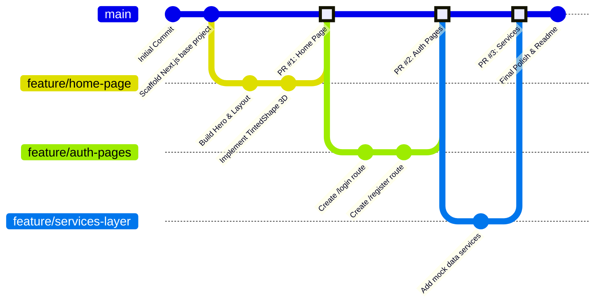

# ByteSpace 

## 🌐 Live Site
- **Live URL:** https://byte-space-task-ynee.vercel.app/

## 🛣️ Page Routes
```text
src/app/
 ├── page.tsx        # `/` - Home Page (Landing page showcasing featured courses, categories, professional growth sections, and testimonials)
 ├── login/
 │   └── page.tsx    # `/login` - User Login Page
 └── register/
     └── page.tsx    # `/register` - User Registration/Sign-up Page
```

## 🛠️ Tech Used
- **Framework:** [Next.js 16](https://nextjs.org/) (App Router)
- **Library:** [React 19](https://react.dev/)
- **Styling:** [Tailwind CSS v4](https://tailwindcss.com/)
- **Language:** TypeScript
- **Package Manager:** pnpm

## ✨ Uniqueness
- **Scalable Coding Structure:** Built with a modular component architecture (e.g., `CourseCard`, `SectionHeader`, `AvatarGroup`) separating common UI elements, layout components, and page-specific blocks to maximize code reuse and maintainability.
- **Responsive Design:** Developed fully responsive layouts that adapt seamlessly to all device sizes, ensuring an optimal user experience on desktop, tablet, and mobile.
- **Separation of Concerns (Services):** Implemented a dedicated `src/services/` layer (e.g., `course.service.ts`, `category.service.ts`) to cleanly handle mock data and abstract business logic independently from UI components.
- **3D Asset Rendering:** Instead of using flattened 2D silhouettes for background shapes, a custom React component (`TintedShape`) was built. It pipes grayscale base images through hardware-accelerated CSS filters, dynamically colorizing the shapes while perfectly preserving their realistic 3D shadows and depth.
- **Standard Git Workflow:** Adhered to strict version control best practices throughout development. The workflow involved scaffolding the base project on `main`, working on isolated feature branches for each major section, and integrating them via Pull Requests after review.

## 🌳 Git Workflow & Collaboration


## 🚀 Local Setup Guideline

To run this project locally on your machine, follow the steps below:

1. **Clone the repository** (if applicable):
   ```bash
   git clone <repository-url>
   cd bytespace_task
   ```

2. **Install dependencies:**
   This project uses `pnpm`. Install the required packages by running:
   ```bash
   pnpm install
   ```

3. **Start the development server:**
   ```bash
   pnpm run dev
   ```

4. **View the application:**
   Open your browser and navigate to [http://localhost:3000](http://localhost:3000).